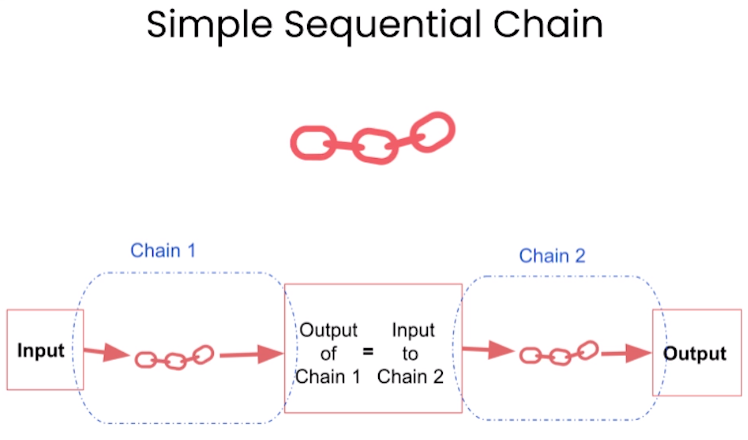
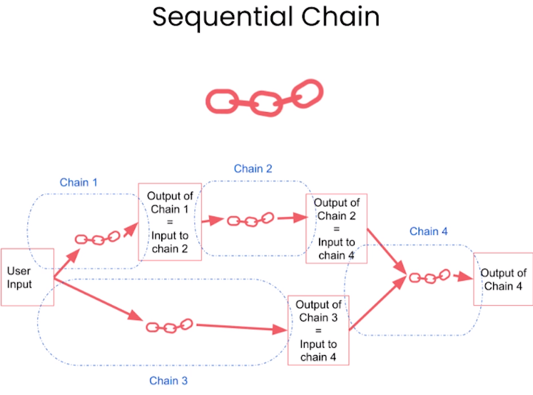
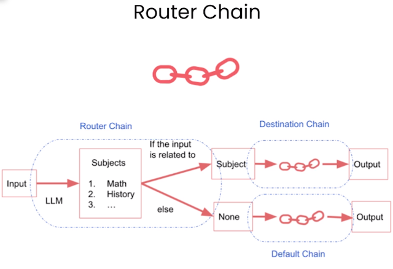

# Chains

- Chain
  - Most important key building block of LangChain
  - Combines LLM together with a prompt

- LLM chain
- Sequential chain
  - Idea: Combine multiple chains where the output of one chain is the input of the next chain.
  - Two types
    - SimpleSequentialChain
      - Single input/output
      
    - SequentialChain
      - Multiple inputs/outputs
      
- Router chain
  - 

## Notebook

- [Jupyter Notebook](../code/L3-Chains.ipynb)
- Unlike previous assignments, higher temperature used as we need the LLM model to be creative in response.
- Errata
  - Corrected the comment for 3rd prompt of SequentialChain
- Modification
  - Added `language` as one of the output variables in SequentialChain
- Issue faced:
  - Executed `SequentialChain` instance using `run` method. This throws error similar to the one discussed in [langchain discussion thread](https://github.com/langchain-ai/langchain/issues/6956).
    - Solution: As [suggested in the same thread](https://github.com/langchain-ai/langchain/issues/6956#issuecomment-1840819367) ran successfully by passing input arguments to the instance directly.
  - Biology question [threw error](https://community.deeplearning.ai/t/lesson-3-chains-invalid-chain-name-biology/394466) as the default chain wasn't executed.
    - As suggested in the thread, passed `silent_errors=True` in `MultiPromptChain`.
