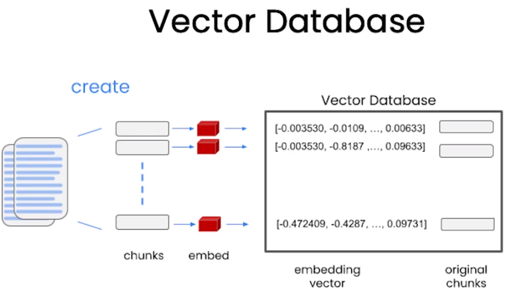
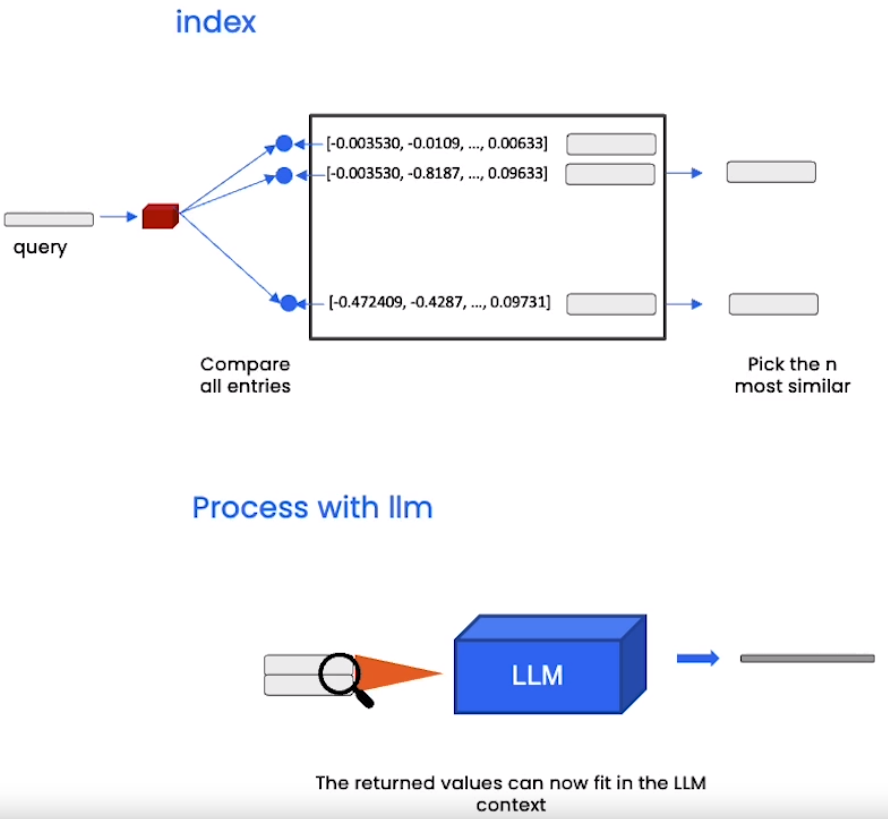

# Question and Answer Over Documents

- Objective:
  - Vector Embedding
  - Vector Store

- Embeddings
  - Captures numerical representation of text
  - Captures content/meaning

- Vector Database
  - Documents are split into chunks which are embedded into vector.
  
  - Query
  

- Stuff method
  - Simplest method
  - Simply stuff all data into the prompt as context to pass to the language model.
    - Pros: LLM has access to all data at once.
    - Cons: Won't work for large documents on many documents as this method will result in a promt larger than LLM's context length.

- Three additional methods
  - Map_reduce
    - All the chunks along with question is passed to different LLMs.
    - Processed in parallel.
    - Then another LLM summarizes the output of all the LLMs.
    - Cons: Chunks are processed independent of each other which may not be the case.
    - A common usecase: Summarization
  - Refine
    - Iteratively loops over documents
    - It builds upon the answer from the previous document.
    - Really good for combining information and building up an answer over time.
  - Map_rerank
    - Do a single call to the language model for each document and ask it to return a score.
    - Then select the highest score.
    - Calls are independent, similar to Map_reduce.

## Notebook

- [Jupyter Notebook](../code/L4-QnA.ipynb)
- [Deprecation announcement](https://platform.openai.com/docs/deprecations/2023-07-06-gpt-and-embeddings) by OpenAI
